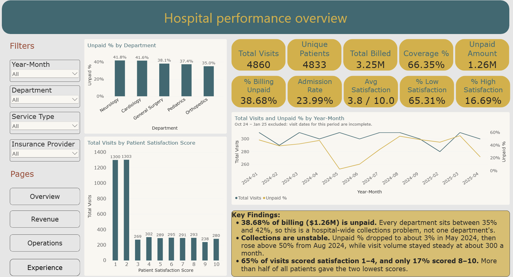
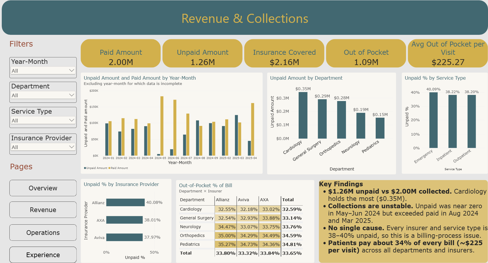

# Hospital Performance Dashboard (Power BI)

A four-page Power BI report built to help hospital management see where revenue is being lost, how much patients are paying, how busy each department is, and how satisfied patients are.



## The problem

The hospital has billed $3.25M, but more than a third of it hasn't been paid. Patient satisfaction is also low. Management wants to know where to focus first: is the unpaid billing coming from particular departments or insurers, and which areas are letting patients down?

## Key findings

**Collections**
- $1.26M (38.7%) of billing is unpaid, against $2.00M collected.
- The problem is hospital-wide. Every department sits between 35% and 42% unpaid, and every insurer and service type between 38% and 40%.
- Cardiology holds the most unpaid money ($0.35M), mainly because it bills the most.
- Collections are unstable. Almost everything was paid in May and June 2024, but in August 2024 and March 2025 more was left unpaid than was collected.

**Patient costs**
- Insurance covers about 66% of each bill. Patients pay the other 34%, around $225 per visit.
- This share is almost the same in every department and with every insurer.

**Operations**
- Orthopedics (36.5%) and Neurology (30.7%) admit the most patients. Cardiology admits only 13.2%.
- Patients stay about 4.9 days whatever their diagnosis.
- Visits are spread evenly across the week.
- Almost no patients come back: 4,860 visits came from 4,833 people, even though half of all visits had a follow-up date booked.

**Patient experience**
- The average satisfaction score is 3.8 out of 10. 65% of visits scored 4 or lower, and only 17% scored 8 or higher.
- Cardiology (3.1) and General Surgery (3.0) have the lowest scores.
- Scores rose from about 1.5 in early 2024 to about 5.5 from August 2024 onwards.

## Recommendations

1. Review the billing and claims process across the whole hospital, since no single department or insurer is causing the unpaid billing.
2. Track the unpaid rate every month, and look at what worked in May and June 2024.
3. Start chasing unpaid bills in Cardiology, General Surgery and Orthopedics, which hold about 73% of the money owed.
4. Focus patient experience work on Cardiology and General Surgery.
5. Plan bed capacity around Orthopedics and Neurology.
6. Find out why booked follow-ups aren't turning into return visits.

## Dashboard pages

| Page | What it shows |
|---|---|
| Overview | Headline KPIs, unpaid % by department, satisfaction score spread, and monthly visits vs unpaid % |
| Revenue & Collections | Paid vs unpaid by month, unpaid billing by department, insurer and service type, and out-of-pocket % by department and insurer |
| Operations & Capacity | Emergency visits by month, admission rate by department, length of stay by diagnosis, and visits by day of week |
| Patient Experience | Satisfaction score spread, high vs low satisfaction, and average score by department |

Every page can be filtered by month, department, service type and insurance provider.



## How I built it

### Data preparation (Power Query)
- Converted the visit, follow-up, admission and discharge dates to proper date types.
- Added an age group column (18–29, 30–44, 45–59, 60+).
- Joined patients to the cities table so each patient shows a city name instead of an ID.
- Replaced "N/A" in room type with "Not Admitted".

The full steps are in the [`power-query`](power-query) folder.

### Data issues I found
While checking the data, I found a few problems and adjusted the report for them:
- **Missing months:** October to December 2024 are mostly missing, and those visits appear to have been dated 1–4 January 2025 instead. I excluded October 2024 to January 2025 from the monthly trend charts so they don't show a false dip and spike.
- **Emergency flag:** some outpatient visits are also flagged as emergencies, so the emergency figures depend on which field you use. The Operations page uses the emergency flag.
- **Missing coverage:** 119 visits have no insurance coverage value.

### Data model
A star schema with `visits` as the fact table, linked to patients, departments, diagnoses, procedures, providers, insurance and a DAX date table.

### Key measures
I paired dollar totals with percentages. A department with more patients will always have more unpaid money, so percentages make the comparison fair.

```dax
Unpaid Amount = CALCULATE([Total Billed], visits[Payment Status] = "Pending")
Unpaid %      = DIVIDE([Unpaid Amount], [Total Billed])

Out of Pocket               = [Total Billed] - [Insurance Covered]
Out of Pocket %             = DIVIDE([Out of Pocket], [Total Billed])
Avg Out-of-Pocket per Visit = DIVIDE([Out of Pocket], [Total Visits])

Admission Rate = DIVIDE([Admissions], [Total Visits])

% Low Satisfaction  = DIVIDE(CALCULATE([Total Visits], visits[Patient Satisfaction Score] <= 4), [Total Visits])
% High Satisfaction = DIVIDE(CALCULATE([Total Visits], visits[Patient Satisfaction Score] >= 8), [Total Visits])
```

All measures are in [`dax/measures.dax`](dax/measures.dax), and the date table is in [`dax/date-table.dax`](dax/date-table.dax).

## Tools
Power BI Desktop, Power Query (M), DAX

## How to open
1. Download [Healthcare_Data_Analysis.pbix](Healthcare_Data_Analysis.pbix).
2. Open it in Power BI Desktop.
3. Use the buttons on the left to switch pages and the slicers to filter.

## Author
Kavish Sharma
